# OKX 가입방법 완벽정리: 본인인증(KYC)부터 수수료 할인까지

---

세계 최대 거래소도 써봤는데 렉 걸리고 불편하다고요? 안전하면서도 쓰기 편한 해외 거래소를 찾고 계신다면, 지금부터 소개할 OKX가 딱 답입니다. 전 세계 파생상품 거래량 2위, 현물 거래량 5위의 거래소를 10분 안에 가입하고 바로 거래 시작할 수 있습니다.

---

비트코인 반감기가 지나고 코인시장 변동성이 미쳤습니다. 선물 거래하는 분들은 롱, 숏 오가며 돈 복사 중이겠죠. 하지만 차트 분석이 빗나가서 방향 잘못 잡으면 위아래로 털립니다. 트레이딩도 안 되는데 거래소가 렉 걸리고 불편하면 진짜 짜증 나죠.

그래서 오늘은 요즘 가장 핫한 거래소 OKX 가입 방법을 알려드립니다. 

**중요:** 그냥 가입하지 마시고 아래 링크로 가입하면 거래 수수료 50% 할인받습니다. 👉 [OKX 수수료 50% 평생 할인받고 가입하기](https://www.okx.com/join/62834398) 거래하다 보면 수수료 할인은 필수입니다. 현 시점 기준 가장 좋은 수수료 요율입니다.

## OKX는 왜 좋은가

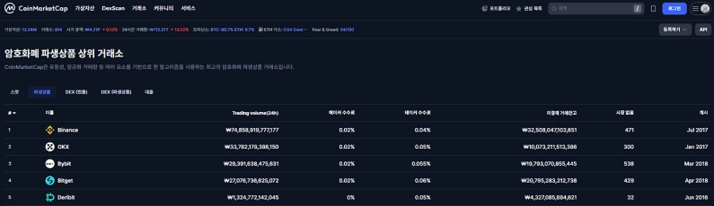

OKX는 코인마켓캡 기준 파생상품 거래량 전 세계 2위, 현물 거래량 전 세계 5위입니다. 사용자가 많은 상위 거래소라는 건 그만큼 안전하다는 뜻이죠. 참고로 한국의 업비트는 현물 기준 4위입니다.

선물거래, 재정거래, 각종 이벤트, 트레이딩 대회 등 해외 거래소를 써야 하는 이유는 많습니다. 지금부터 가입 시작합니다.

## 회원가입 시작

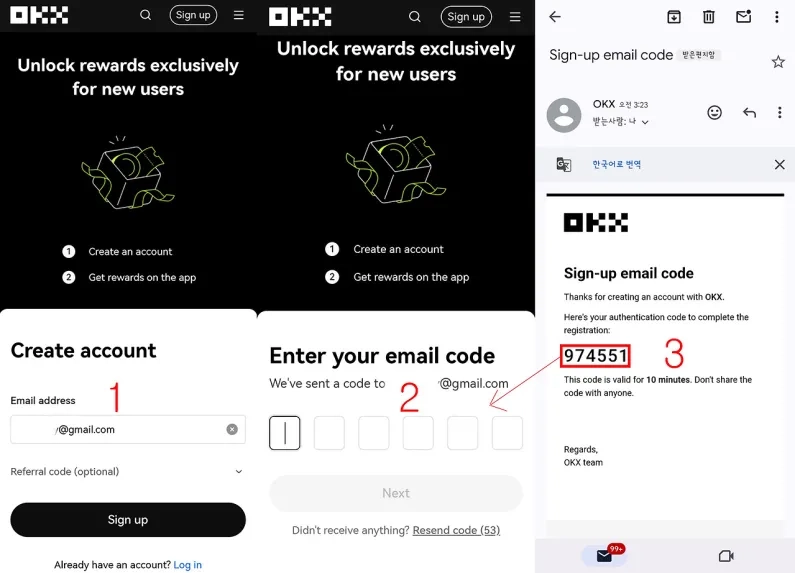

1. 이메일 주소를 넣고 **Sign up** 버튼을 클릭합니다.
2. 본인 이메일 확인을 위해 인증번호가 자동으로 전송됩니다.
3. 이메일 받은 편지함에서 OKX 메일을 열어 **인증번호 6자리**를 확인합니다. 인증번호를 입력하고 **Next** 버튼 클릭.

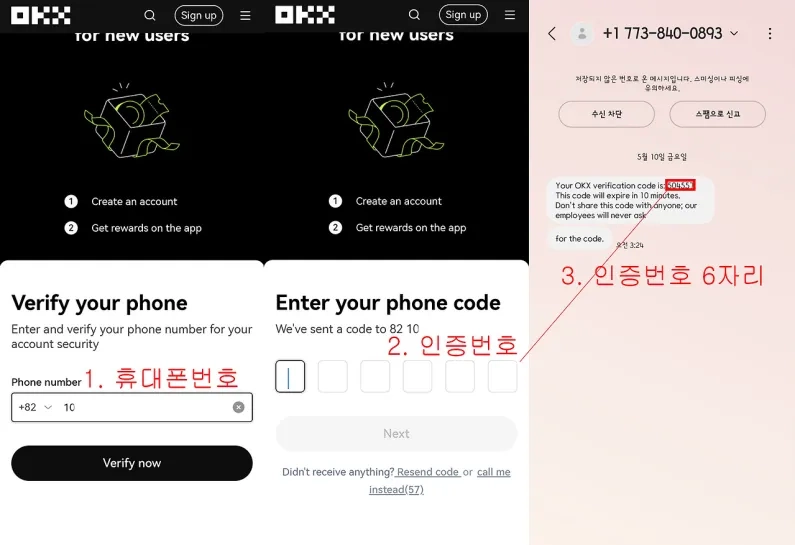

1. 본인 휴대폰 번호를 넣고 **Verify now** 버튼을 누릅니다.
2. 휴대폰으로 **코드번호 6자리**가 문자로 옵니다.
3. 문자로 받은 코드번호 6자리를 입력하고 **Next** 버튼 클릭.

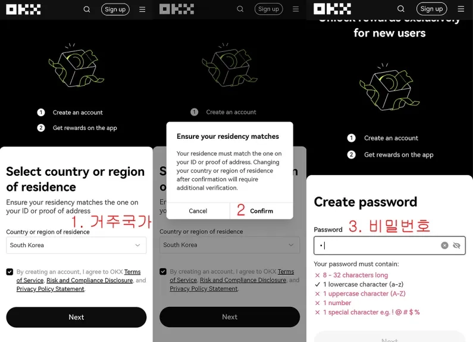

1. 거주 국가를 선택합니다. 한국이면 **South Korea**가 자동 선택되어 있습니다. 체크박스에 체크하고 **Next** 버튼 클릭.
2. 신분증 주소와 선택한 국가가 일치해야 한다는 안내가 뜹니다. **Confirm** 버튼을 누릅니다.
3. 비밀번호를 설정합니다. **비밀번호는 8자~32자 사이로, 영어 소문자 1개, 영어 대문자 1개, 숫자 1개, 특수문자 1개를 반드시 포함해야 합니다.**

## OKX 앱 설치 및 로그인

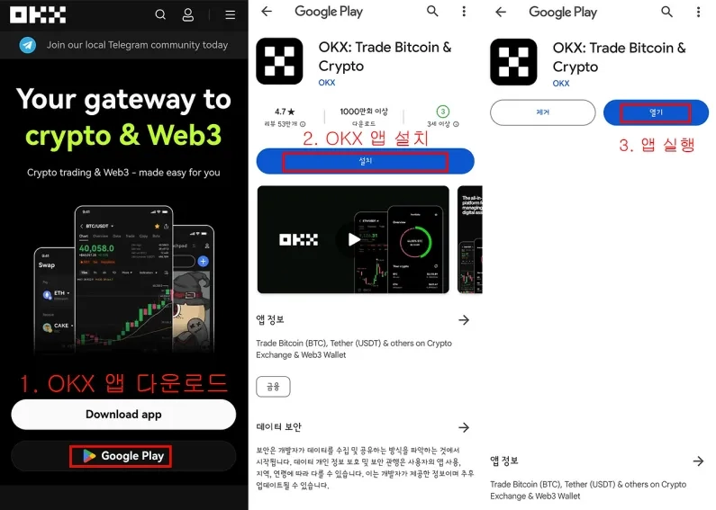

여기까지 따라왔다면 자동으로 OKX 앱 설치 페이지가 나옵니다.

1. 안드로이드 사용자는 **Google Play** 버튼을 눌러 구글 플레이로 이동합니다.
2. 설치 버튼을 눌러 OKX 앱을 **설치**합니다.
3. 설치가 끝나면 열기 버튼을 눌러 앱을 **실행**합니다.

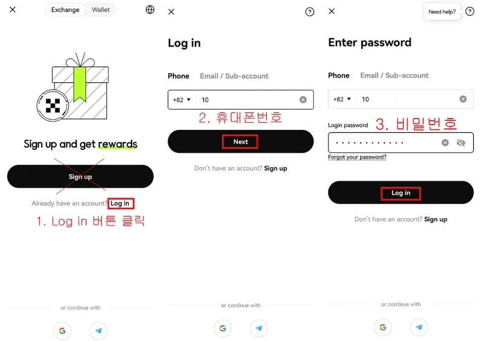

1. 앱을 실행하면 나오는 첫 화면에서 **Log in** 버튼을 누릅니다. **Sign up 버튼 누르면 안 됩니다.**
2. 휴대폰번호를 입력하고 **Next** 버튼 클릭.
3. 비밀번호를 입력하고 **Log in** 버튼 클릭.

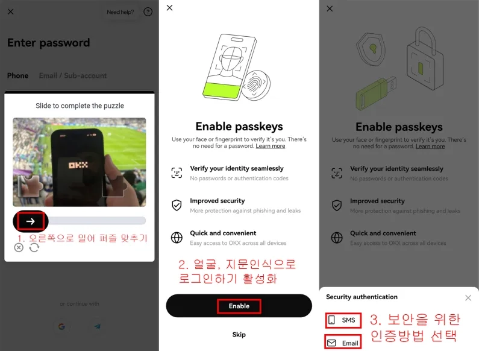

1. 로그인 확인을 위해 **화살표를 오른쪽으로 슬라이드**해서 퍼즐을 맞춥니다.
2. 매번 아이디와 비밀번호 입력하기 귀찮으니 생체인식 로그인 기능을 활성화합니다. **Enable** 버튼을 누릅니다.
3. 보안 인증을 위해 문자 메시지나 이메일 중 원하는 방법을 선택합니다. 저는 **SMS** 문자 메시지를 선택했습니다.

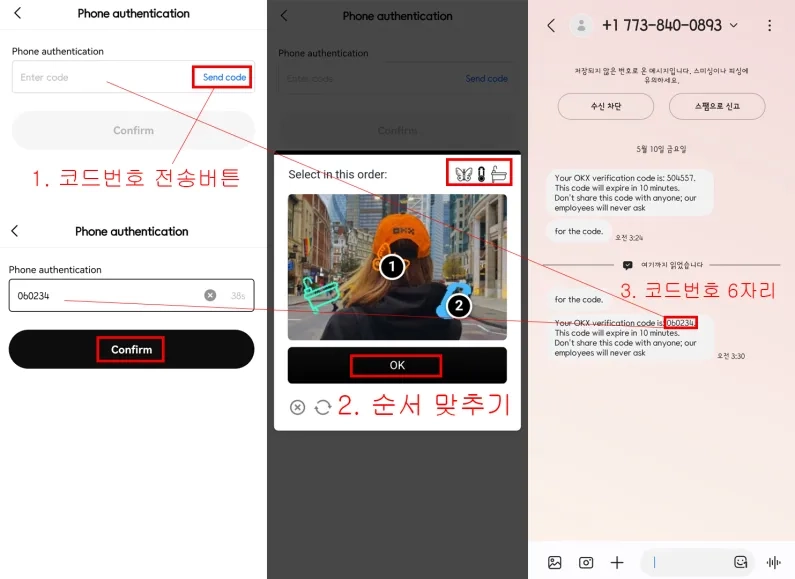

1. **Send code** 버튼을 눌러 인증 코드를 보냅니다.
2. 사람 확인을 위한 순서 맞추기 창이 뜹니다. 오른쪽 위의 **그림 순서대로 사진에서 찾아 클릭**한 후 OK 버튼을 누릅니다.
3. 선택한 인증 수단으로 6자리 인증 코드가 옵니다. **6자리 코드번호를 입력**하고 **Confirm** 버튼을 누릅니다.

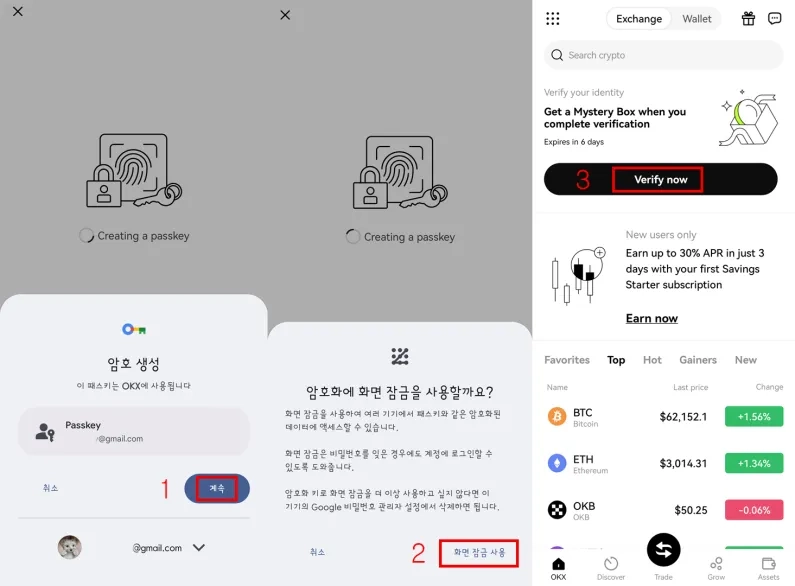

1. Passkey 생성 화면입니다. **계속** 버튼을 누릅니다.
2. **화면잠금 사용** 버튼을 누릅니다.
3. OKX 앱 메인 화면입니다. 아직 본인인증을 안 했으니 **Verify now** 버튼을 눌러 본인인증 화면으로 넘어갑니다.

## 본인인증(KYC) 진행

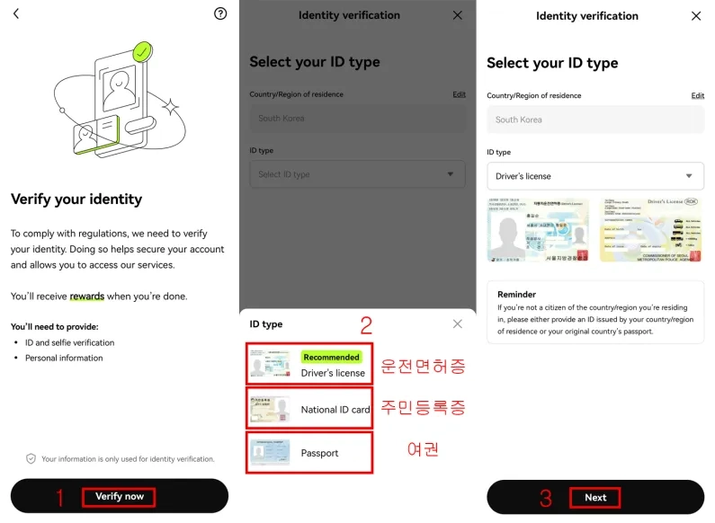

1. 본인인증 시작 화면입니다. **Verify now** 버튼을 누릅니다.
2. 인증할 신분증을 선택합니다. **운전면허증**이 권장됩니다.
3. 한국 운전면허증 예시가 나옵니다. **Next** 버튼을 누릅니다.

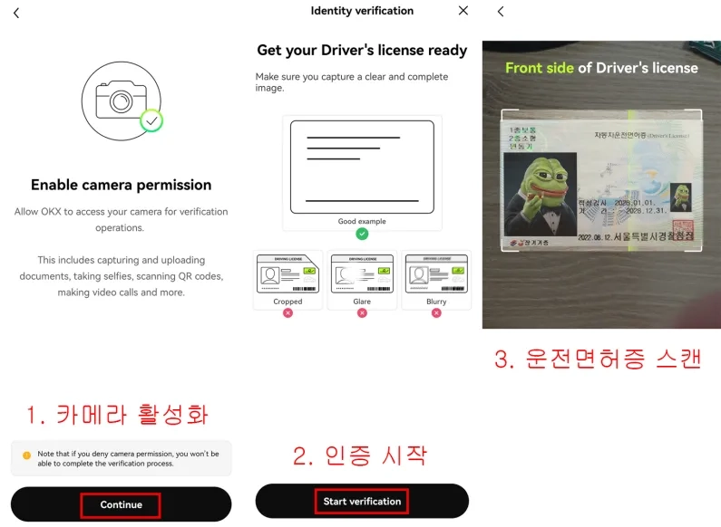

1. 신분증 촬영을 위해 휴대폰 카메라를 활성화합니다. **Continue** 버튼을 누릅니다.
2. **Start verification** 버튼을 눌러 인증을 시작합니다. 신분증이 가려지거나 빛에 반사되거나 흐릿하면 안 됩니다.
3. 카메라가 켜지면 선택한 신분증을 하얀색 가이드에 맞춥니다. 자동으로 스캔됩니다. 빛 반사로 글씨가 안 보이거나 다른 물체에 가려지면 안 됩니다.

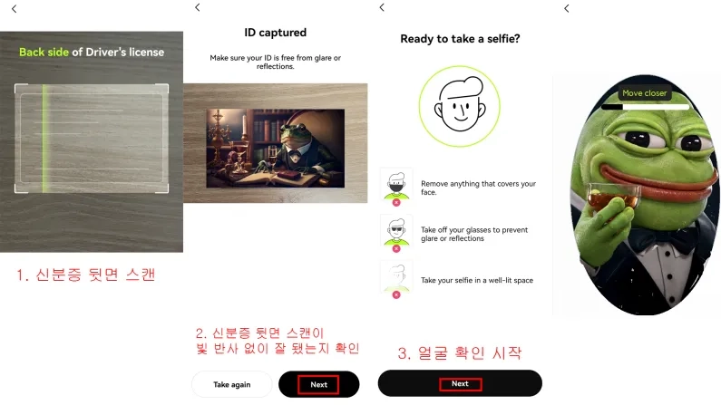

1. 동일한 방법으로 신분증 뒷면을 스캔합니다.
2. 촬영된 신분증에 빛 반사로 글씨가 안 보이는 곳이 없는지 확인합니다. 없으면 **Next** 버튼을 누릅니다.
3. 신분증과 동일인인지 얼굴확인을 합니다. **마스크, 선글라스는 착용하면 안 됩니다.** 너무 멀리나 가까이 있어도 안 됩니다. 화면에 **얼굴이 잘 보일 정도의 거리에서 촬영**합니다.

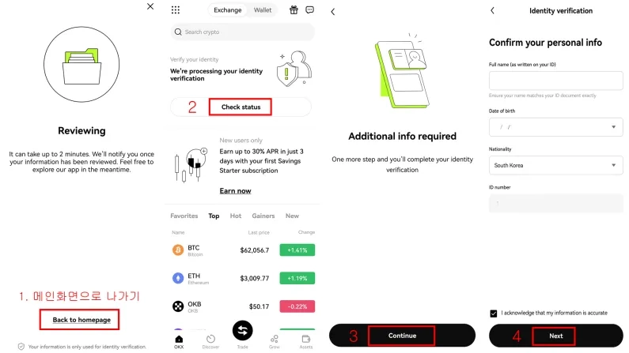

여기까지 왔다면 축하합니다. OKX 회원가입 및 본인인증 절차가 끝났습니다. 심사는 약 2~3분 정도 걸립니다.

1. **Back to homepage** 버튼을 눌러 메인화면으로 나갑니다.
2. 제출한 자료를 심사 중입니다. 2~3분 후 **Check status** 버튼을 눌러 현재 상태를 확인합니다.
3. 부족한 부분이 있다면 추가정보를 입력하라고 나옵니다. 안 나올 수도 있습니다. 나온다면 **Continue** 버튼을 눌러 추가정보를 입력합니다.
4. 신분증 상의 이름, 숫자, 생년월일 등이 맞다면 **Next** 버튼을 누릅니다.

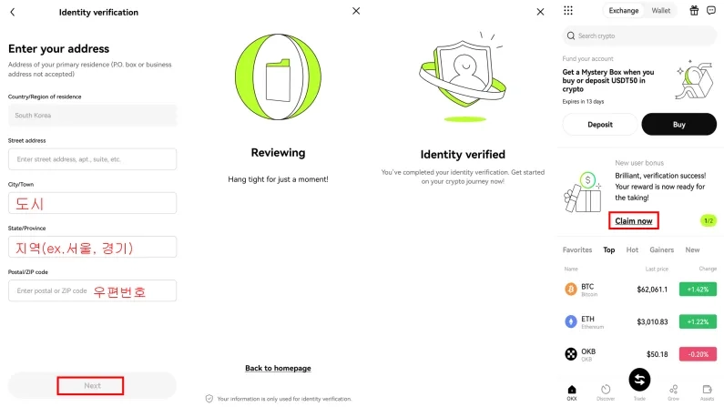

1. 추가정보에 필요한 정보를 입력합니다. 기본 주소가 입력되어 있지만 빈칸이 있다면 채워야 합니다. 위에서부터 도로명 주소, 도시, 지역, 우편번호입니다. 빈칸을 다 채웠으면 Next 버튼을 누릅니다.
2. 심사 중이라고 나오고 문제없다면 거의 바로 본인인증 완료 메시지가 나옵니다.

---

여기까지 따라오시느라 수고하셨습니다. OKX는 다른 거래소에 비해 회원가입과 본인인증이 쉽고 간편합니다. 사람들이 많이 좋아하는 거래소에는 역시 이유가 있습니다.

새로운 거래소에서 거래를 시작하기 전에, 👉 [수수료 50% 할인 혜택을 꼭 확인하고 시작하세요](https://www.okx.com/join/62834398). 장기적으로 거래하다 보면 수수료 할인이 엄청난 차이를 만듭니다. OKX는 빠른 체결 속도와 안정적인 시스템으로 트레이딩에 집중할 수 있는 환경을 제공합니다. 여러분의 트레이딩에 달러가 쉴 새 없이 흘러 들어오길 기원합니다.
